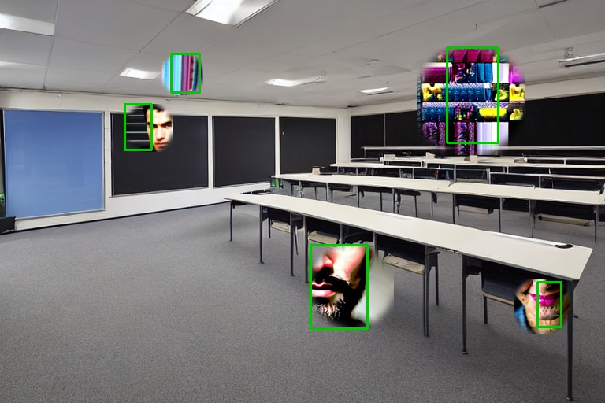
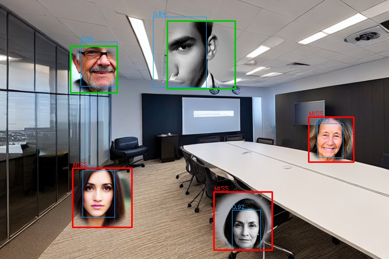

# modulabs-mainquest2-poc
모두의연구소 AI 에이전트 1기 Main Quest 2 — 내 도메인에서 AI 개선 지점 발굴 및 PoC 구현

> **강의 자료용 현장 사진의 개인정보 마스킹 후보 자동 탐지**
> 도메인: 모두의연구소 캠프 운영 — 학습 콘텐츠 제작 **(가상 설정)**

### ⚠️ 먼저 밝혀 둡니다 — 가상의 업무 상황입니다

작성자는 현재 수행 중인 실무가 없는 캠프 수강생입니다. 그래서 **운영팀의 콘텐츠 제작 업무를 가상으로 설정**해 문제 정의부터 검증까지 진행했습니다.

| | |
| --- | --- |
| **가정한 것** | 업무 절차, 발생량(행사당 200~500장), 처리 시간(장당 1~3분), 현행 누락률(5%) |
| **실제로 잰 것** | 얼굴 탐지 후보 셋의 성능, SAM의 마스크 축소율, 합성 데이터 60개 얼굴과 정답 |

**따라서 이 저장소가 증명하는 것은 "기술적으로 되는가"까지입니다.** 현행 수준을 잰 적이 없으므로 "업무가 얼마나 좋아졌는가"는 증명하지 않았고, 그렇게 주장하지도 않습니다. 자세한 구분은 [PROBLEM.md 0-3절](docs/PROBLEM.md#0-3-무엇이-가정이고-무엇이-실제인가).

**가정한 상황은 이렇습니다.** 행사 사진 200~500장에서 동의하지 않은 인물의 얼굴을 담당자가 눈으로 찾아 하나씩 가립니다. 장당 1~3분, 한 행사에 하루가 들어가고, 지치면 뒷줄의 작은 얼굴을 놓칩니다. **한 장만 놓쳐도 유출이고 공개된 뒤에는 되돌릴 수 없습니다.**

이 PoC는 **가려야 할 후보 영역을 찾아 주는 앞단**을 자동화합니다. 최종 확인 버튼은 사람이 누릅니다.


---

## 결과 요약

| 후보 | 실행 위치 | 재현율 | 놓침 | 오탐(장당) | 장당 시간 |
| --- | --- | --- | --- | --- | --- |
| 기준선 · Haar Cascade | 노트북 | 75.0% (45/60) | 15 | 0.25 | 0.086초 |
| **YuNet (선정)** | 노트북 | **96.7% (58/60)** | **2** | **0.00** | **0.044초** |
| YOLOv8n person | 노트북 | 41.7% (25/60) | 35 | 0.17 | 0.522초 |
| ~~외부 Vision API~~ | ~~외부~~ | — | — | — | 개인정보 조건으로 **점수 측정 전 제외** |

성공 기준 세 항목(재현율 ≥95% · 수작업보다 빠름 · 장당 오탐 ≤2)을 **모두 통과**했습니다.
다만 **그 기준의 근거(현행 누락률 5%)가 가정값**이라, 통과가 곧 도입 근거는 아닙니다.
파이프라인 확장으로 SAM을 붙여 가리는 넓이를 **29.3% 줄였습니다.**

**세 모델이 한 줄로 이어집니다: Stable Diffusion(자료 생성) → YuNet(탐지) → MobileSAM(마스크 정제)**

---

## 문서

| 문서 | 내용 |
| --- | --- |
| **[docs/PROBLEM.md](docs/PROBLEM.md)** | **문제 정의서** — 도메인 선정 맥락, 현재의 문제, 개선 가설, 대상 사용자, 성공 기준 |
| **[docs/EXPERIMENT.md](docs/EXPERIMENT.md)** | **모델 선정 근거와 검증 결과** — 후보 비교, 기존 방식과의 비교, 한계, 다음 단계 |
| **[docs/PITFALLS.md](docs/PITFALLS.md)** | **실패 기록** — 정답이 얼굴이 아니었던 일, 채점표가 틀려 멀쩡한 모델을 떨어뜨릴 뻔한 일 |
| [explore_text_triage/REPORT.md](explore_text_triage/REPORT.md) | 후보 탐색 과정. 다른 지점(문의 분류)을 먼저 만들어 봤고 **기준선이 이겼습니다** |

---

## 실행 방법

### 준비

```bash
pip install -r requirements.txt
```

GPU가 없으면 `requirements.txt`의 torch 세 줄을 지우고 `pip install torch torchvision`으로 CPU 빌드를 쓰세요. 탐지는 CPU로도 충분하고, 데이터 생성만 느려집니다(장당 1분 내외).

YuNet 가중치(228KB, Apache-2.0)는 `poc/models/`에 포함돼 있어 따로 받을 것이 없습니다.
YOLO·SAM 가중치와 Stable Diffusion 가중치(약 4.5GB)는 처음 실행할 때 자동으로 받습니다.

> 탐지만 다시 돌려 보려면 3단계를 건너뛰어도 됩니다. `poc/data/`에 생성된 자료와 정답이
> 이미 들어 있어 **GPU 없이 `detect_faces.py`부터 바로 실행**할 수 있습니다.

### 1. 검증 자료 만들기

```bash
cd poc && python build_dataset.py --n-scenes 12 --out data
```

빈 강의실 12장과 얼굴 8명을 생성해 합성합니다. 정답 상자는 이 단계에서 확정됩니다.

**만들고 나면 두 가지를 눈으로 확인하세요.** 이 확인을 건너뛰어서 두 번 헛돌았습니다([PITFALLS.md](docs/PITFALLS.md)).

- `data/face_pool_contact.png` — 생성된 것이 정말 얼굴인가
- `data/gt_vis/` — 정답 상자가 얼굴에 맞게 붙었는가

### 2. 후보 셋 비교

```bash
python detect_faces.py --candidates baseline_haar,yunet_face,yolo_person
```

`results/<후보>/vis/`에 채점 결과가 그려져 나옵니다. 초록은 잡은 정답, **빨강은 놓친 정답(MISS)**, 파랑은 예측 상자와 신뢰도입니다.

임계값을 바꿔 가며 돌려도 **이전 결과를 덮어쓰지 않습니다** (`__2`, `__3`이 붙습니다).

```bash
python detect_faces.py --candidates yunet_face --yunet-conf 0.5 --cover-thr 0.6
```

### 3. SAM으로 마스크 다듬기

```bash
python refine_sam.py --detector yunet_face
```

`results/sam_refined/`에 `*_box.jpg`(상자 블러)와 `*_sam.jpg`(SAM 마스크 블러)가 나란히 저장됩니다.

### 4. 시연 이미지 만들기

```bash
python make_figures.py --scene scene_03.png
python make_pitfall_figures.py            # 실패 사례 재현 (docs/assets/)
```

---

## 동작 결과

### 후보 비교 — 같은 사진, 세 후보


Haar는 작은 얼굴과 정면이 아닌 얼굴에서 무너지고, YOLO person은 **몸통이 없는 합성 이미지**라 원리적으로 불리합니다(그래서 이 숫자는 실사에 그대로 옮겨 읽으면 안 됩니다). YuNet은 60개 중 58개를 잡았습니다.

### 상자 블러 vs SAM 마스크 블러


가리는 넓이가 평균 29.3% 줄어 사진이 살아납니다.

### 실패 사례 — 정답 쪽이 틀렸던 두 번

| | |
| --- | --- |
|  |  |
| **정답이 얼굴이 아니었다.** 얼굴을 256px로 생성해 노이즈가 나왔는데, 개수는 60개로 정상이라 숫자만 봐서는 알 수 없었습니다. | **정답 상자가 얼굴보다 컸다.** 예측(파랑)이 얼굴에 정확히 붙어 있는데도 MISS로 세어졌습니다. 모델이 아니라 채점표가 틀렸습니다. |

두 번 다 **집계 숫자가 아니라 그려 놓은 이미지**가 잡아냈습니다.

---

## 구조

```
docs/
  PROBLEM.md        문제 정의서
  EXPERIMENT.md     모델 선정 근거와 검증 결과
  PITFALLS.md       실패 기록
  assets/           실패 사례 재현 이미지
poc/
  build_dataset.py       ① SD로 검증 자료 생성 + 정답 확정
  detect_faces.py        ② 후보 셋 탐지·채점·시각화
  refine_sam.py          ③ SAM 마스크 정제
  make_figures.py        시연 이미지
  make_pitfall_figures.py 실패 사례 재현
  data/                  생성된 자료와 정답 (ground_truth.json, gt_vis/)
  results/               후보별 건별 점수와 시각화
explore_text_triage/     후보 탐색 과정 (기준선이 이긴 기록)
```

---

## 라이선스 확인 (2026-08-14 기준)

| 구성요소 | 라이선스 | 이 용도 |
| --- | --- | --- |
| OpenCV (Haar, YuNet 실행) | Apache-2.0 | 문제 없음 |
| YuNet 가중치 (OpenCV Zoo) | Apache-2.0 | 문제 없음 |
| **Ultralytics (YOLO, SAM)** | **AGPL-3.0** | 사내 사용은 문제 없음. **닫힌 제품에 넣어 배포하면 소스 공개 의무.** 상용 라이선스 별도 판매 |
| Stable Diffusion 1.5 | CreativeML Open RAIL-M | 검증 자료 생성 용도. 사용 제한 조항 확인 필요 |

값과 라이선스는 바뀝니다. 확인한 날짜를 함께 남겼습니다.
