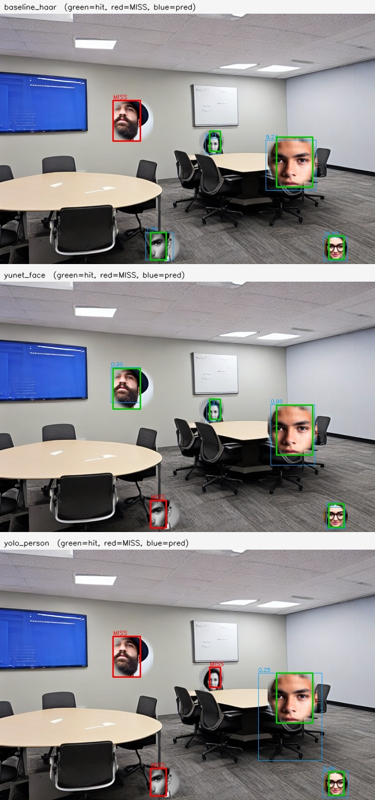
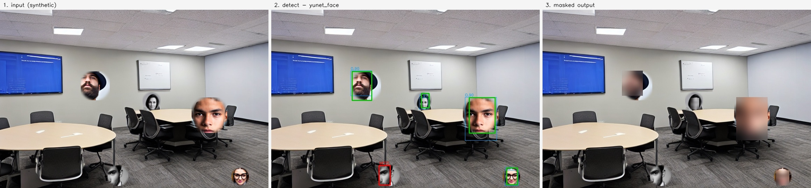
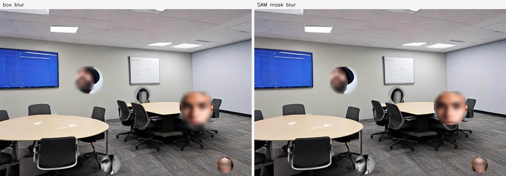

# 모델 선정과 개선 효과 검증

문제 정의서: [PROBLEM.md](PROBLEM.md) · 만들면서 걸린 것들: [PITFALLS.md](PITFALLS.md)
실행 환경: Windows 11 · Python 3.14 · RTX 3070 (8GB) · CUDA 12.8 · 2026-08-14

---

## 1. 후보 구성 — 크기가 아니라 종류로 벌린다

흔한 후보 구성은 한 모델의 대·중·소 세 등급입니다. 그렇게 놓으면 표에 나타나는 것은 크기가 만드는 차이뿐이고, 그건 재 보기 전에도 아는 것입니다. 그래서 **성격이 갈리게** 놓았습니다.

| 후보 | 실행 위치 | 만들어진 목적 | 결과의 형태 | 라이선스 |
| --- | --- | --- | --- | --- |
| **기준선** OpenCV Haar Cascade | 노트북 (CPU) | 얼굴 전용, 딥러닝 이전 방식 | 상자 + 이웃 수(신뢰도 대용) | Apache-2.0 |
| **A** OpenCV YuNet | 노트북 (CPU) | **얼굴 전용** 소형 CNN | 상자 + **짝마다 독립된 신뢰도** | Apache-2.0 |
| **B** YOLOv8n (person 클래스) | 노트북 (GPU) | **범용** 객체 탐지 | 사람 전체 상자 + 신뢰도 | **AGPL-3.0** ⚠ |
| ~~C 외부 클라우드 Vision API~~ | ~~외부 서비스~~ | — | — | — |

### 기준선을 후보에 넣은 이유

지금 그 업무를 처리하는 방식이 이미 있습니다. 그것을 후보에 넣지 않으면 **새로 만든 것이 쓸 만한지 판단할 기준선이 없습니다.** 개선 폭을 모르는 채로 도입을 결정하게 됩니다.

(실제로 이 과제의 앞선 탐색에서는 기준선이 이겼습니다. 문의 분류 PoC에서 키워드 규칙이 18/20으로 임베딩 모델을 눌렀습니다 → [`explore_text_triage/REPORT.md`](../explore_text_triage/REPORT.md))

### 후보 C를 점수 없이 제외한 이유

입력이 **마스킹하기 전 원본 사진**입니다. 개인정보를 가리려고 만드는 도구인데 가리기 전 원본을 외부로 보내는 것은 목적과 정면으로 충돌합니다.

**점수를 재지 않았습니다.** 조건에 걸리는 후보는 성능이 얼마든 제외이고, 점수를 매겨 두면 "이게 제일 잘하는데"라는 미련이 남아 결국 표에 다시 올라옵니다. 그러면 쓸 수 없는 후보가 1위가 되고, 자료가 외부로 나간다는 사실은 각주로 밀립니다.

### 라이선스에서 걸린 것

**YOLOv8(Ultralytics)은 AGPL-3.0입니다.** 사내 콘텐츠 제작에 쓰는 지금 용도는 문제가 없습니다. 다만 이 도구를 닫힌 제품에 넣어 배포하면 소스 공개 의무가 걸리고, 만든 쪽이 그 의무를 없앤 상용 라이선스를 별도로 팝니다. **배포 계획이 생기면 여기서 결정이 납니다.**

선정된 YuNet은 Apache-2.0이라 이 제약이 없습니다. 성능과 별개로 이 점이 유리합니다.

---

## 2. 검증 자료

**합성 데이터 12장 / 얼굴 60개.** 실제 수강생 사진을 쓰지 않고 검증하기 위한 구성입니다.

- 배경: Stable Diffusion 1.5로 강의실·회의실·세미나홀 등 **빈 공간** 12장 생성
- 얼굴: SD 1.5로 **연령·성별·안경·수염이 다른 8명** 생성 (512px)
- 합성: 장면마다 서로 다른 얼굴 5명을, 겹치지 않게, **크기를 넓게 흔들어** 배치
- 얼굴 폭 분포: **최소 22px / 중앙값 55px / 최대 102px**

작은 얼굴을 일부러 넣었습니다. 쉬운 것만 모으면 후보들이 전부 비슷해 보이고 표가 아무것도 알려 주지 않습니다. 실제로 두 후보를 가른 것이 이 작은 얼굴들이었습니다.

**정답은 모델을 돌리기 전에 확정했습니다.** 얼굴 8장을 격자와 함께 띄워 놓고 얼굴이 차지하는 영역을 눈으로 읽어 손으로 적었고(`FACE_BOXES`), 합성할 때 그 비율을 붙이는 크기에 곱해 정답 상자를 만듭니다. 정답 오버레이는 `poc/data/gt_vis/`에 남아 있습니다.

> ⚠️ **이 정답 정의를 한 번 틀렸습니다.** 처음에는 붙여넣은 정사각형 전체를 정답으로 잡았고, 그 결과 얼굴을 정확히 찾은 YuNet이 50%로 나왔습니다. 자세한 것은 [PITFALLS.md 2번](PITFALLS.md).

### 채점 기준

정답 얼굴이 예측 상자에 **50% 이상 덮이면** 잡은 것으로 셉니다. IoU를 쓰지 않은 이유는 이 업무의 판정이 "상자가 정확한가"가 아니라 **"그 얼굴이 가려지는가"** 이기 때문입니다. ([PITFALLS.md 4번](PITFALLS.md))

---

## 3. 결과

```
python detect_faces.py --candidates baseline_haar,yunet_face,yolo_person
```

| 후보 | 재현율 | 놓침 | 오탐(장당) | 장당 처리 시간 | 성공 기준 |
| --- | --- | --- | --- | --- | --- |
| 기준선 Haar | 75.0% (45/60) | 15 | 0.25 | 0.086초 | ❌ 재현율 미달 |
| **A. YuNet** | **96.7% (58/60)** | **2** | **0.00** | **0.044초** | ✅ **통과** |
| B. YOLO person | 41.7% (25/60) | 35 | 0.17 | 0.522초 | ❌ 재현율 미달 |

### 성공 기준 대조

| 기준 | 목표 | YuNet | 판정 |
| --- | --- | --- | --- |
| ① 재현율 | 60개 중 57개 이상 (미탐 ≤3) | **58개 (미탐 2)** | ✅ |
| ② 처리 시간 | 장당 수작업보다 짧다 | **0.044초** vs 수작업 60~180초 | ✅ |
| ③ 오탐 | 장당 2개 이하 | **0.00개** | ✅ |

**세 항목 모두 통과. 선정: YuNet.**

재현율·놓침·오탐은 seed 가 고정돼 있어 몇 번을 돌려도 같습니다. 처리 시간만 실행마다 흔들리므로 자릿수 비교로만 읽으십시오.


*초록 = 잡은 정답, 빨강 = 놓친 정답(MISS), 파랑 = 예측 상자와 신뢰도*

### 왜 이렇게 갈렸는가

**YOLO person이 41.7%로 꼴찌인 것은 모델이 나빠서가 아닙니다.** 이 데이터는 얼굴만 배치한 합성 이미지라 **몸통이 없습니다.** 사람 전체를 찾도록 학습된 모델에게는 애초에 찾을 단서가 없는 입력입니다. 실제 현장 사진(몸이 함께 찍힘)에서는 결과가 크게 달라질 수 있고, **이 표의 YOLO 숫자는 실사에 그대로 옮겨 읽으면 안 됩니다.** 합성 데이터의 한계가 특정 후보에만 불리하게 작용한 경우입니다.

**Haar가 75%인 것은 작은 얼굴과 정면이 아닌 얼굴에서 무너지기 때문입니다.** 딥러닝 이전 방식의 알려진 한계이고, 예상대로 나왔습니다.

**YuNet이 놓친 2개는 가장 작은 얼굴들입니다.**

| 파일 | 놓친 얼굴 크기 | 최대 덮임 |
| --- | --- | --- |
| scene_03.png | 32 × 56 px | 0.0 |
| scene_05.png | 28 × 48 px | 0.0 |

덮임이 0.0이라는 것은 **아깝게 빗나간 것이 아니라 아예 탐지되지 않았다**는 뜻입니다. 30px 안팎이 이 구성의 하한입니다.

### 임계값을 걸 수 있는가

YuNet의 탐지 신뢰도는 **최소 0.367 / 중앙값 0.913 / 최대 0.938**입니다. 짝마다 독립적으로 학습된 값이라 **임계값을 걸 수 있습니다.** 순위를 맞히도록 학습된 모델이라면 값이 한쪽으로 몰려 구분되지 않습니다.

다만 **지금 구성에서는 임계값을 올릴 이유가 없습니다.** 오탐이 이미 0이고, 이 업무는 미탐이 치명적이라 임계값을 올리면 손해만 봅니다. 임계값은 오탐이 늘어나는 실사 자료에서 다시 정해야 합니다.

---

## 4. 기존 방식과의 비교

| | 지금 방식 (수작업) | PoC (YuNet + SAM) |
| --- | --- | --- |
| 얼굴 찾기 | 담당자가 눈으로 훑음 | 자동, 장당 0.044초 |
| 장당 소요 | 1~3분 | 확인·가감 시간만 |
| 200장 기준 | **3~10시간** | 탐지 9초 + 확인 시간 |
| 누락률 | 5% 안팎 (⚠️ 추정, 미실측) | 3.3% (2/60) |
| 일관성 | 담당자·피로도에 따라 변동 | 동일 입력 → 동일 출력 |
| 기록 | 없음 | 장별 후보 수·신뢰도가 JSON으로 남음 |

**시간 비교는 공정하지 않다는 점을 밝힙니다.** PoC의 0.044초는 **탐지만** 걸린 시간이고, 사람이 확인·가감하는 시간은 빠져 있습니다. 이 도구는 최종 판정을 대신하지 않으므로 실제 절감분은 "찾는 시간"에 한정됩니다. 정확한 비교는 담당자에게 후보가 표시된 상태로 200장을 처리하게 해서 재야 합니다. **아직 재지 않았습니다.**


*입력 → 탐지 → 마스킹. 왼쪽 아래 얼굴이 마스킹 결과에도 그대로 남아 있는 것이 놓친 2개 중 하나입니다.*

---

## 5. 파이프라인 확장 — SAM으로 마스크 다듬기

탐지가 내주는 것은 직사각형입니다. 직사각형을 그대로 블러하면 배경까지 뭉개져 사진의 쓸모가 줄어듭니다. **MobileSAM**에 탐지 상자를 프롬프트로 주면 그 안에서 사람 영역만 분리해 줍니다.

```
python refine_sam.py --detector yunet_face
```

| | 가리는 화소 비율 |
| --- | --- |
| 상자 그대로 블러 | 0.0874 (평균) |
| SAM 마스크 블러 | 0.0620 (평균) |
| **감소** | **29.3%** |



**이 단계는 성공 기준의 판정 항목이 아닙니다.** 탐지가 기준을 넘은 뒤에 붙이는 단계입니다. 판정 항목을 늘리면 항목마다 기준을 따로 세워야 하고, 기준을 세울 자료가 없는 항목이 생깁니다.

세 모델이 한 파이프라인으로 이어집니다: **Diffusion(자료 생성) → YuNet(탐지) → SAM(마스크 정제)**

---

## 6. 한계

**1. 합성 데이터는 실사와 다릅니다.** 얼굴이 몸통 없이 공중에 떠 있고, 붙여넣은 경계의 조명이 배경과 맞지 않습니다. 실제 현장 사진에서는 (a) 옆모습·뒷모습, (b) 겹친 얼굴, (c) 모션 블러, (d) 역광이 추가로 나타납니다. **이 표의 96.7%를 실사 성능으로 읽으면 안 됩니다.** 도입 판단 전에 실제 행사 사진 50장으로 다시 재야 합니다.

**2. YOLO 숫자는 이 자료에서 무의미합니다.** 몸통이 없는 입력이라 person 탐지가 원리적으로 불리했습니다. 실사 자료에서 다시 재야 공정한 비교가 됩니다.

**3. 30px 미만 얼굴은 놓칩니다.** 뒷줄·원경 인물이 여기 걸립니다. 고해상도 원본을 타일로 잘라 각각 탐지하면 개선될 수 있지만 확인하지 않았습니다.

**4. 성공 기준의 근거가 약합니다.** 재현율 95%의 근거인 "현행 누락률 5%"는 **실측하지 않은 추정치입니다.** 필자는 운영팀 내부자가 아니라 수강생으로서 이 도메인을 관찰했고, 발생량·처리 시간·누락률은 관찰 범위 밖이라 일반적인 값으로 잡았습니다. 어디까지가 관찰이고 어디부터가 추정인지는 [PROBLEM.md 0절](PROBLEM.md#0-도메인을-이렇게-고른-맥락)에 표로 정리했습니다. 사람이 실제로는 2%만 놓친다면 96.7%는 도입할 값이 없다는 뜻이 됩니다.

**5. 얼굴 외의 개인정보는 다루지 않습니다.** 명찰, 노트북 화면의 이름, 화이트보드에 적힌 연락처는 판정 항목에 넣지 않았습니다.

---

## 7. 다음 단계

우선순위 순입니다. **모델을 바꾸는 것은 이 셋 다음입니다.**

1. **현행 수준 실측.** 담당자에게 실제 행사 사진 50장을 처리하게 하고 걸린 시간과 누락 수를 셉니다. 성공 기준의 숫자를 여기서 다시 씁니다.
2. **실사 자료로 재검증.** 동의를 받은 사진 50장으로 같은 표를 다시 만듭니다. 특히 YOLO person 후보를 공정한 조건에서 다시 봅니다.
3. **확인 UI.** 담당자가 후보를 보고 추가·제외하는 화면이 없으면 이 파이프라인은 실무에 못 들어갑니다. PoC에서 가장 큰 미구현 부분입니다.
4. (그다음) 타일 분할 탐지로 작은 얼굴 개선, 명찰·화면 텍스트 탐지 항목 추가.
